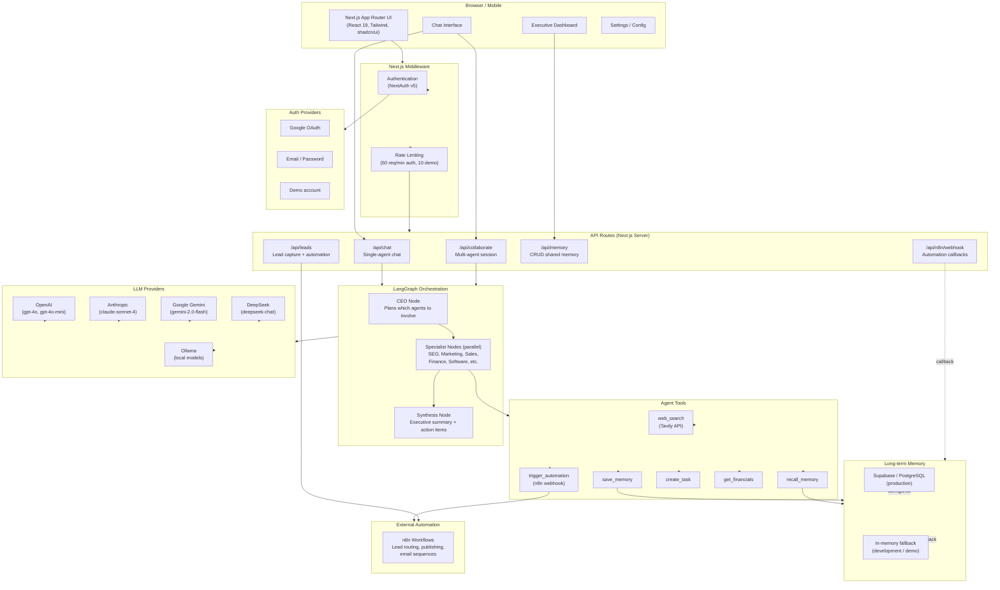
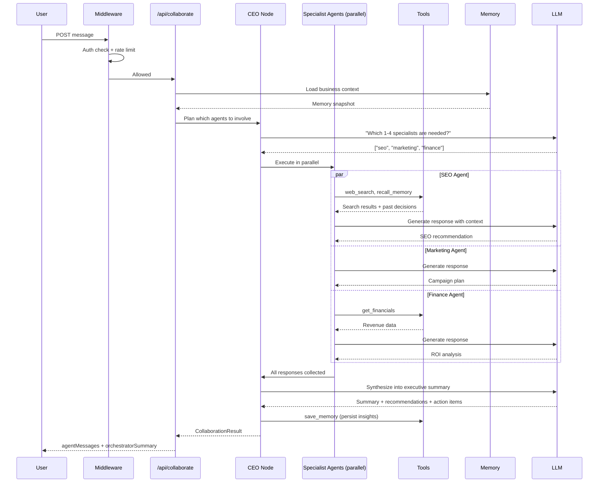
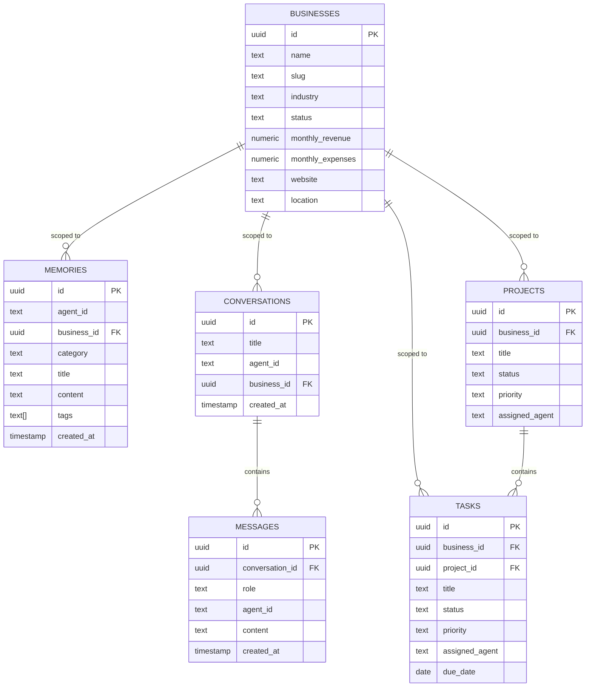

# Executive OS — Architecture

## Overview

Executive OS is a **local-first AI business operating system** built on Next.js with a true multi-agent architecture. Each AI employee is a specialized LangGraph node with its own system prompt, tool access, and memory scope.

---

## System Architecture



---

## Request Flow: Team Collaboration



---

## Data Model



---

## Tech Stack

| Layer | Technology |
|-------|-----------|
| Framework | Next.js 16 (App Router, React 19) |
| Language | TypeScript 5 |
| Styling | Tailwind CSS 4, shadcn/ui |
| Multi-agent | LangGraph, LangChain |
| LLM providers | OpenAI, Anthropic, Gemini, DeepSeek, Ollama |
| Auth | NextAuth v5 (Google OAuth + Credentials) |
| Rate limiting | In-memory (dev), Upstash Redis (production) |
| Database | Supabase (PostgreSQL) with in-memory fallback |
| Automation | n8n (webhooks) |
| CI/CD | GitHub Actions → Vercel |
| Testing | Jest + ts-jest, AI eval harness |
| Container | Docker + docker-compose |

---

## Deployment Options

```
┌─────────────────────────────────────┐
│            Vercel (PaaS)            │
│  Next.js serverless functions       │
│  Automatic deploys from GitHub      │
│  Preview URLs per PR                │
└──────────────┬──────────────────────┘
               │
        ┌──────┴───────┐
        │              │
┌───────▼──────┐ ┌─────▼───────────┐
│   Supabase   │ │   Upstash Redis │
│  PostgreSQL  │ │   Rate limiting  │
│  Auth tables │ │                  │
└──────────────┘ └─────────────────┘

─────── OR ───────

┌─────────────────────────────────────┐
│          Docker Compose (VPS)       │
│  app: Next.js (port 3000)           │
│  supabase-db: PostgreSQL (5432)     │
│  ollama: local LLMs (11434)         │
│  n8n: automation (5678)             │
└─────────────────────────────────────┘
```
